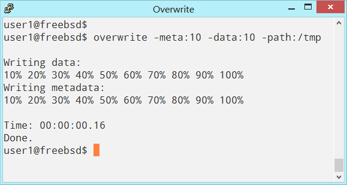

# overwrite-testing
Overwrite repository for testing, issues, collaboration.

This repository is for testing, issues, collaboration for overwrite project on link: 
https://github.com/ivoprogram/overwrite

The objectives are to test the overwrite project, publish results, report issues.
The testing should be done on different file systems and operating systems.

The collaborators should upload directory with their user name, publish tests and results and report issues.

