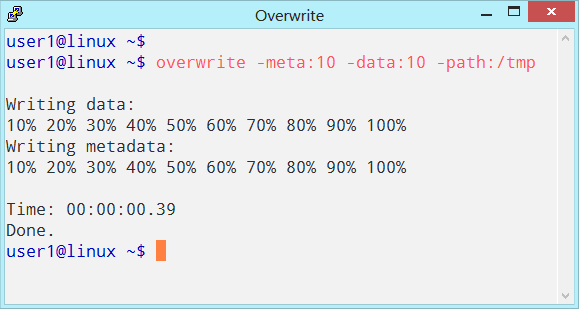

# Overwrite Testing
Overwrite repository for testing, issues, collaboration.

**Development Finished** \
The project is not in development any more. \
The development phase of this project has been finished, the objectives has been achived.

This repository is for testing, issues, collaboration for Overwrite Program on link: \
https://github.com/ivoprogram/overwrite

The objectives are to test the Overwrite Program, publish results, report issues. \
The testing should be done on different File Systems, Operating Systems, Hard Disk, SSD Disk, USB Stick, SD Card.

The collaborators should upload folder with their user name, publish tests and results and report issues.

&nbsp;
&nbsp;

