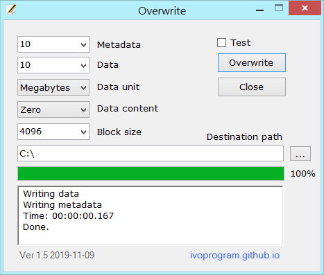

# Overwrite Testing
Overwrite repository for testing, issues, collaboration.

This repository is for testing, issues, collaboration for Overwrite Program on link: \
https://github.com/ivoprogram/overwrite

The objectives are to test the Overwrite Program, publish results, report issues. \
The testing should be done on different File Systems, Operating Systems, Hard Disk, SSD Disk, USB Stick, SD Card.

The collaborators should upload folder with their user name, publish tests and results and report issues.

**Contributors**
- https://github.com/UlrichBerntien Thanks to @UlrichBerntien for contributing in testing to create better overwrite program.

&nbsp;
&nbsp;

